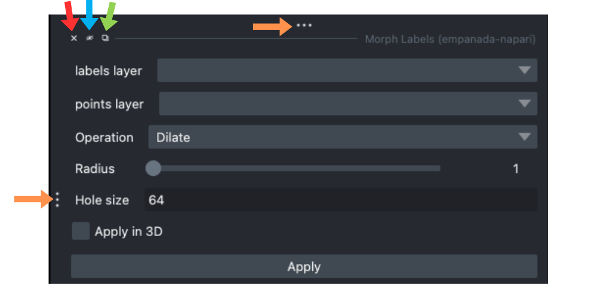
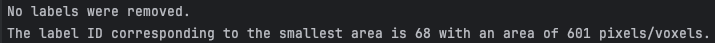

.. _proofreading_tips:

Proofreading Tips & Tricks
----------------------------

At this time, empanada-napari does not have an undo button for proofreading modules. Therefore, it is recommended to apply
any corrections to a duplicated labels layer and periodically export your segmentations.

.. tip::

    It is helpful to rename the duplicated layer in napari to something that is easily identifiable. You may need to close and
    reopen the modules to see the new name in the dropdown menus.

    .. dropdown:: Steps on how to duplicate and rename image layers:

        To create a duplicated labels layer:

        #. Select the layer you want to duplicate in the napari layers list (panel a)

        #. Then right click, and select **Duplicate layer** (panel b).

        #. To rename the newly created layer, double click the layer. This will highlight the text and you can enter in the new name (panel c and d)

        |pic1| |pic2|

        .. |pic1| image:: ../_static/layer-dup-a.png
           :width: 50%

        .. |pic2| image:: ../_static/layer-dup-c.png
           :width: 50%

After creating finetune/training patches, it is helpful to either hide the original grayscale and label layers or
to remove them from the napari window completely. This is especially helpful due to the different dimensions of the smaller
patches/flipbooks created and the original images.

If you have multiple modules open and the napari window is in fullscreen mode, the bottom of the screen may become hidden from time to time.
To fix this, simply exit out of the fullscreen mode and adjust the size of the window. Closing (red arrow), hiding (blue arrow), floating (green arrow), or
adjusting (orange arrows) the module panels may also help.

One way to correct over-merged instances, is to *erode* the label using the :ref:`Morph Labels <morph-labels>` module until the borders of the objects are clear.
Then place points where you would like the new centers to be and use the :ref:`Split Labels <split-labels>` module (with
the **Use points as markers** option selected). After the labels have been accurately seperated, you can then *dilate* the labels
using the **Morph Labels** module.

.. image:: ../_static/morph-split-example.pmg
    :align: center
    :width: 100%

Another option is to erase the unwanted parts (most likely the *connecting branches*) and then split the labels. This
can potentially take longer if labels are in 3D as you will need to scroll through the stack and erase on each slice.

If you are proofreading segmentations on smaller patches that will be stitched together into a larger image later (most
common with AT datasets), you can specify new label IDs using the :ref:`Split Labels <split-labels>` module. This can help reduce the
number of repeated label ID values in the final large image. Utilizing this feature can also be helpful when multiple people
are correcting smaller patches of the same dataset.

.. tip::

    Use the :ref:`Count Labels <count-labels>` module on the full image to get the initial number of instances and their
    label IDs. After the patches are created, pick a number that is greater than the max label ID number (i.e., the large
    image has a max label ID of 1072, pick 2001 to be safe). If another person is proofreading different patches from the
    same dataset, they can select a different starting point (i.e., they can select 3001 to start from).

The :ref:`Filter labels <filter-labels>` module will print out the list of label IDs removed for both the **remove small labels**
and **remove boundary labels** options. If the value entered in the **Minimum pixel/voxel area** is too small, the terminal will
display the smallest label ID and it's corresponding area.

