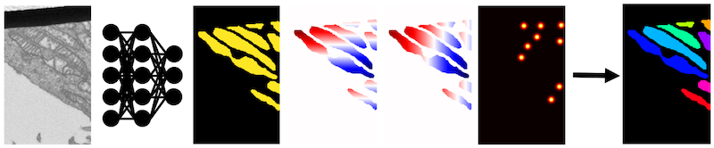

.. _model-background:

Model Background
-----------------

The empanada-napari plugin is built to democratize deep learning image segmentation for researchers in electron
microscopy (EM). It ships with MitoNet, a generalist model for the instance segmentation of mitochondria.

MitoNet
========

MitoNet is an generalist deep learning model specifically developed for instance segmentation of mitochondria
within EM images. It is pre-trained on a diverse dataset of approximately 1.5 million unlabeled cellular EM images, and
subsequently trained on ~135k labeled mitochondrial instances.

Leveraging elements from Panoptic DeepLab and Panoptic BiFPN models, MitoNet’s architecture is
optimized to handle the complex shapes of mitochondria in EM images. The model’s performance was evaluated on
challenging volume EM benchmarks to test its ability for accurate and precise segmentations. (Check out the
full paper linked below)

NucleoNet
========

NucleoNet is a pre-trained deep learning model specifically designed for the accurate and efficient segmentation of
nuclei in volume electron microscopy (vEM) images. Integrated within the user-friendly empanada plugin for napari,
NucleoNet leverages convolutional neural networks (CNNs) and has been trained on large, diverse, and carefully
annotated datasets.

This allows researchers to bypass the need for extensive manual annotation and significant computational resources when
segmenting nuclei in their vEM data. By providing a robust and readily available solution, NucleoNet streamlines
the analysis of nuclear structures, facilitating high-throughput and precise investigations in cell biology.

DropNet
========

DropNet is a pre-trained deep learning model included in the empanada plugin, specifically designed for the segmentation
of lipid droplets within volume electron microscopy (vEM) images. Utilizing convolutional neural networks (CNNs),
DropNet has been trained on extensive and meticulously curated datasets of lipid droplets. This integration within
empanada offers researchers a readily accessible and powerful tool to automate the segmentation of these crucial
cellular components, reducing the burden of manual analysis and enabling more efficient and detailed studies of lipid
metabolism and cellular organization.

Overall
========

These models accept a grayscale EM image and output a semantic segmentation, up-down and right-left offsets, and a
heatmap with peaks at object centers. After postprocessing, a panoptic (or in the case below, instance) segmentation
is created.

    EM image (left) passes through the model and outputs, in order,
    a semantic segmentation, up-down and left-right offsets, centers heatmap.
    The panoptic (or instance) segmentation is created via postprocessing.

**Check out the full paper in Cell Press here:**

.. grid:: 2
    :padding: 2 2 0 0

    .. grid-item::

        .. image:: ../_static/mitonet_pipeline.png
            :class: sd-m-auto

    .. grid-item-card::
        :link: https://www.cell.com/cell-systems/fulltext/S2405-4712(22)00494-X
        :width: auto

        `Instance segmentation of mitochondria in electron microscopy images with a generalist deep learning model <https://www.cell.com/cell-systems/fulltext/S2405-4712(22)00494-X>`_ :octicon:`link-external`

        Conrad, R., & Narayan, K.

        (2023). Cell Systems, 14(1), 58-71. e5. //doi.org/10.1016/J.CELS.2022.12.006

