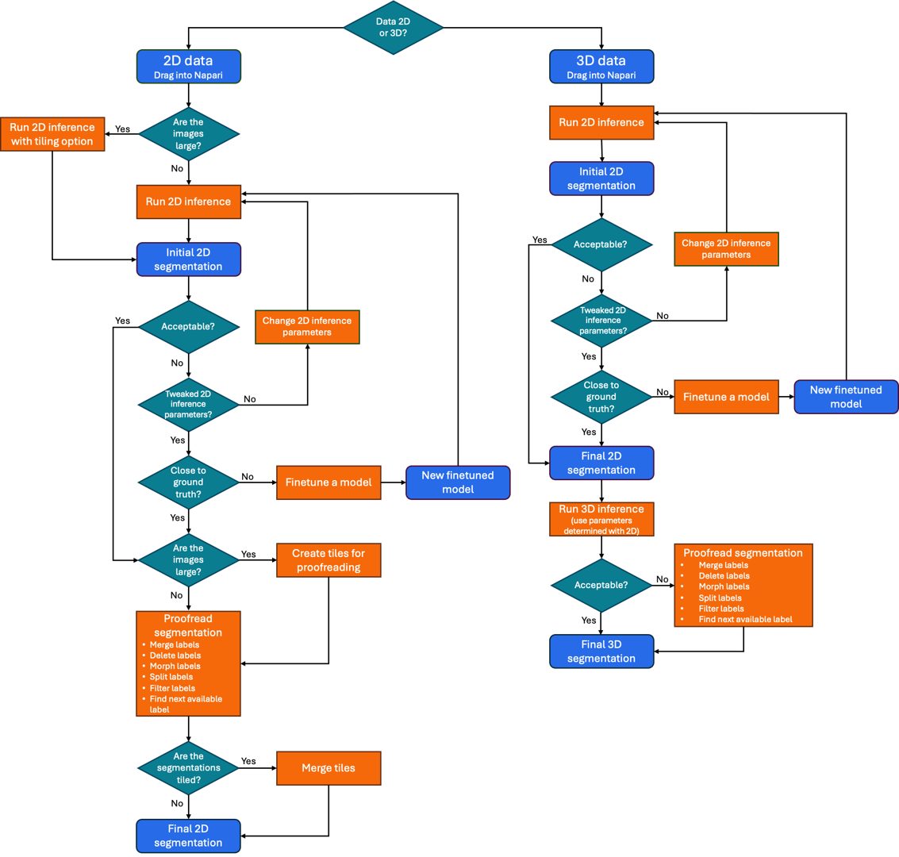

.. _empanada-napari:

:html_theme.sidebar_secondary.remove:

.. raw:: html

   

empanada-napari
================

.. image:: _static/empanada-logo-new.gif
    :width: 1000px
    :height: 500px
    :align: center

.. grid:: 4
    :gutter: 2 2 4 4
    :padding: 4 4 0 0

    .. grid-item-card:: :octicon:`download` Getting Started
        :shadow: md

        Step-by-step **installation instructions** for the latest version for new or returning users
        +++

        .. button-ref:: getting_started
            :ref-type: ref
            :click-parent:
            :color: primary
            :expand:

            Getting Started

    .. grid-item-card:: :octicon:`image` Modules
        :shadow: md

        Detailed descriptions of parameters, outputs and demo videos of all the modules included in empanada-napari

        +++
        .. button-ref:: modules
            :ref-type: ref
            :click-parent:
            :color: primary
            :expand:

            Modules

    .. grid-item-card:: :octicon:`north-star` Tutorials
        :shadow: md

        Indepth tutorials on how to finetune, train and run inference through this plugin

        +++

        .. button-ref:: tutorials
            :ref-type: ref
            :click-parent:
            :color: primary
            :expand:

            Tutorials

    .. grid-item-card:: :octicon:`upload` Share your model
        :shadow: md

        Share your trained model with the us and the vEM community

        +++

        .. button-ref:: share-model
            :ref-type: ref
            :click-parent:
            :color: primary
            :expand:

            Share your model

.. important::

   empanada-napari version 1.2 is now available! This latest version has new models for nuclei and lipid droplets, new plugins and updated 2D and 3D inference modules.
   We have also frozen the numba (0.59.0) and napari (0.4.18) versions to avoid dependency conflicts.
   Check out how to update to the latest version :ref:`here! <update-install>`

.. note::

   Windows users who are working with GPUs, please see an important note about installation steps in our :ref:`FAQ section <general-faqs>`.

Suggested Workflow
-----------------

.. grid:: 4
    :gutter: 2 2 4 4
    :padding: 4 4 0 0

Citing this work
^^^^^^^^^^^^^^^^

.. grid:: 2

    .. grid-item::

        .. grid:: 1 1 1 1

              .. image:: _static/cell_press_cover.png
                  :class: sd-m-auto

    .. grid-item::

        .. grid:: 1 1 1 1

              .. grid-item-card::
                  :width: auto

                  **If you use results generated by this plugin in a publication, please cite:**

              .. grid-item-card::
                  :link: https://www.cell.com/cell-systems/fulltext/S2405-4712(22)00494-X
                  :width: auto

                  `Instance segmentation of mitochondria in electron microscopy images with a generalist deep learning model <https://www.cell.com/cell-systems/fulltext/S2405-4712(22)00494-X>`_ :octicon:`link-external`

                  Conrad, R., & Narayan, K.

                  (2023). Cell Systems, 14(1), 58-71. e5. //doi.org/10.1016/J.CELS.2022.12.006

This version of empanada-napari was created by Abhishek Bhardwaj `<https://cmm.ccr.cancer.gov/volume-em/>`_ :octicon:`link-external`

.. toctree::
   :maxdepth: 2
   :hidden:

   Getting Started <getting_started/index>
   Modules <modules/index>
   Tutorials <tutorials/index>
   Best Practices <best_practice/index>
   FAQs <faq/index>

