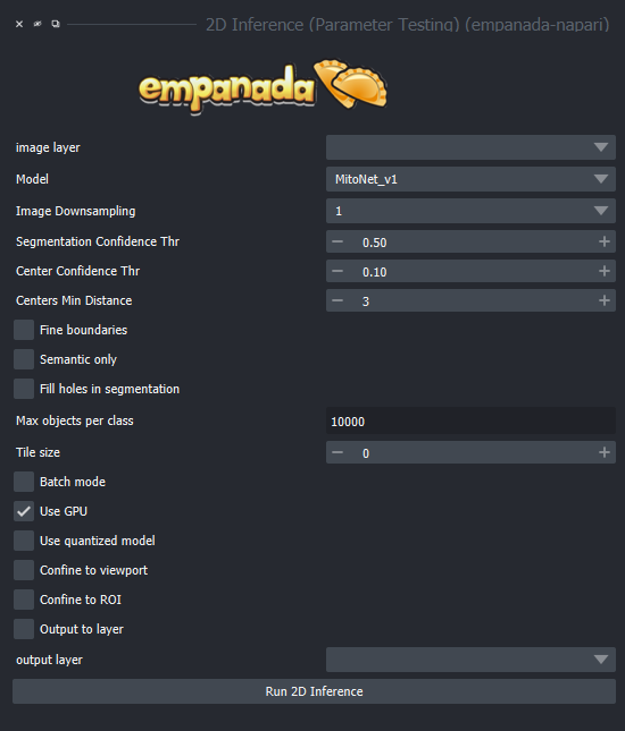

.. _2d-inference:

2D Inference (Parameter Testing)
----------------------------------

Parameters
============

**image layer:** The napari image layer on which to run model inference.

**Model:** Model to use for inference. Default options are MitoNet_v1, MitoNet_v1_mini, NucleoNet_base_v1 and DropNet_base_v1.

**Image Downsampling:** Downsampling factor to apply to the input image before running
model inference. The returned segmentation will be interpolated to the original
binary segmentation.

**Center Confidence Thr:** The minimum intensity of a peak in the centers heatmap
for it to be considered a true object center.

**Centers Min Distance:** The minimum distance allowed between centers in pixels.

**Fine boundaries:** Whether to run Panoptic DeepLab postprocessing at 0.25x the
input image resolution. Can correct some segmentation errors at the cost of 4x
more GPU/CPU memory during postprocessing.

**Semantic Only:** Whether to skip panoptic postprocessing and return only a semantic
segmentation.

**Fill holes in segmentation:** If checked will fill holes in the segmentation label map.

**Max objects per class:** The maximum number of objects that are allowed for any one
of the classes being segmented by the model.

**Tile size:** Size of image tiles in pixels. When set to 0, inference will be run on the entire image
in a single pass. For non-zero tile sizes, the image will be partitioned into patches, model inference will be
run independently on each, and the results are stitched together. By default, all tiles have a minimum overlap of
128 pixels with their neighbors.

**Batch Mode:** If checked, the selected model will be run independently on each
xy slice in a stack of images. This can be used, for example, to run inference on
all images in a folder by loading them with the "Open Folder..." option.

**Use GPU:** Whether to use system GPU for running inference. If no GPU is detected
on the workstation, then this parameter is ignored.

**Use quantized model:** Whether to use a quantized version of the segmentation model.
The quantized model only runs on CPU but uses ~4x less memory and runs 20-50% faster (depending
on the model architecture). Results may be 1-2% worse than using the non-quantized version.
Quantized models do not work on all operating systems and hardware configurations. Currently,
they are not supported by Apple Silicon.

**Confine to viewport:** When checked, model inference will only be performed on the area of the image
currently visible in the Napari viewing window. This makes it possible to navigate large images and selectively
test model performance within a 2D ROI. This option will return an error if run on xz slices of a 3D image.

**Confine to ROI:** ROIs can be created using a Shapes layer in Napari. When 2D inference is run it will only be performed on the areas within the drawn using the Shapes layer.

**Output to layer:** If checked, the output of the model will be inserted into the given
output layer (next argument). This argument is incompatible with Batch mode and will raise
an error if both are checked.

**output layer:** If Output to layer is checked, the output of the model will be inserted
into this layer, otherwise a new layer will be created. The output layer must be the same
shape as the image layer.

See :ref:`Inference Best Practices <inference-best-practice>` for more usage notes.

Output
=======

Returns a 2D labels layer in the napari viewer or inserts a predicted
segmentation into a selected labels layer.

.. note::

   With the new models (NucleoNet and DropNet) a connection with the internet is required for their first use.

Demo
=======

.. image:: ../_static/demo.gif
    :width: 1000px
    :align: center
    :alt: 2D inference demo

Check out the step-by-step tutorial :ref:`here <2d-inference-tutorial>`

