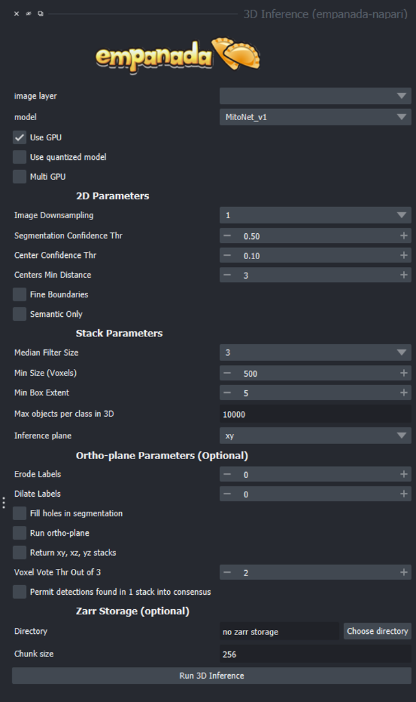

.. _3d-inference:

3D Inference
-------------

General Parameters
===================

**image layer:** The napari image layer on which to run model inference.

**model:** Model to use for inference.

**Use GPU:** Whether to use system GPU for running inference. The box will be
check by default if a GPU is found on your system. If no GPU is detected, then
this parameter is ignored.

**Use quantized model:** Whether to use a quantized version of the segmentation model.
The quantized model only runs on CPU but uses ~4x less memory and runs 20-50% faster (depending
on the model architecture). Results may be 1-2% worse than using the non-quantized version.
Quantized models do not work on all operating systems and hardware configurations. Currently,
they are not supported by Apple Silicon.

**Multi GPU:** If the workstation is equipped with more than 1 GPU, inference
can be distributed across them. See note in :ref:`Inference Best Practices <inference-best-practice>`.

2D Parameters
^^^^^^^^^^^^^^^^

**Image Downsampling:** Downsampling factor to apply to the input image before running
model inference. The returned segmentation will be interpolated to the original
image size using the Point Rend module.

**Segmentation Confidence Thr:** The minimum confidence required for a pixel to
be classified as foreground. This only applies for binary segmentation.

**Center Confidence Thr:** The minimum intensity of a peak in the centers heatmap
for it to be considered a true object center.

**Centers Min Distance:** The minimum distance allowed between centers in pixels.

**Fine boundaries:** Whether to run Panoptic DeepLab postprocessing at 0.25x the
input image resolution. Can correct some segmentation errors at the cost of 4x
more GPU/CPU memory.

**Semantic Only:** Whether to skip panoptic postprocessing and return only a semantic
segmentation.

Stack Parameters
^^^^^^^^^^^^^^^^^^^

**Median Filter Size:** Number of image slices over which to apply a median filter
to semantic segmentation probabilities.

**Min Size (Voxels):** The smallest size object that's allowed in the final
segmentation as measured in voxels.

**Min Box Extent:** The minimum bounding box dimension that's allowed for an
object in the final segmentation. (Filters out big "pancakes").

**Max objects per class in 3D:** The maximum number of objects that are allowed for any one
of the classes being segmented by the model within a volume.

**Inference plane:** Plane from which to extract and segment slices. Choice of xy, xz, or yz.

Ortho-plane Parameters (Optional)
^^^^^^^^^^^^^^^^^^^^^^^^^^^^^^^^^^^^

**Run ortho-plane:** Whether to run ortho-plane inference. If unchecked, inference
will only be run on slices from the Inference plane chosen above.

**Return xy, xz, yz stacks:** Whether to return the panoptic segmentation stacks created
during inference on each plane. If unchecked, only the per-class consensus volumes
will be returned.

**Voxel Vote Thr Out of 3:** Number of stacks from ortho-plane inference in which a voxel
must be labeled in order to end up in the consensus segmentation.

**Permit detections found in 1 stack into consensus:** Whether to allow objects
that appear in only a single stack (for example an object only segmented in xy)
through to the ortho-plane consensus segmentation.

Zarr Storage (Optional)
^^^^^^^^^^^^^^^^^^^^^^^^^^^^^^^^^^^^

**Directory:** Path at which to store segmentation results in zarr
format. Writing results to disk can help avoid out-of-memory issues when running
inference on large volumes. Napari natively supports reading zarr files.

**Chunk size:** Chunk size to use for the Zarr file. Can be an integer for cube-shaped
chunks or a comma separated list of 3 integers to other chunk sizes.

Output
==========

Returns a 3D labels layer in the napari viewer for each segmentation class and,
optionally, panoptic segmentation stacks.

Demo
======

.. image:: ../_static/3d_inference-demo.gif
    :width: 1000px
    :align: center
    :alt: 3D inference demo

Check out the step-by-step tutorial :ref:`here <3d-inference-tutorial>`