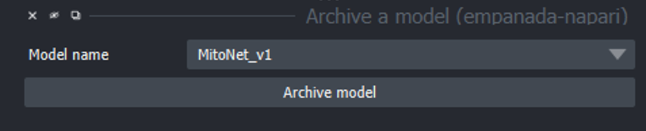

.. _archive-model:

Archive a Model
------------------

Parameters
================

**Model name:** Choose from the dropdown list the model to be archived.

Output
===========

Archive model will write model to a hidden file and remove the model from the dropdown list of models in the 2D and 3D inference modules.
If you would like to recover an archived model, please contact nci-cmm@mail.nih.gov for recovery instruction
