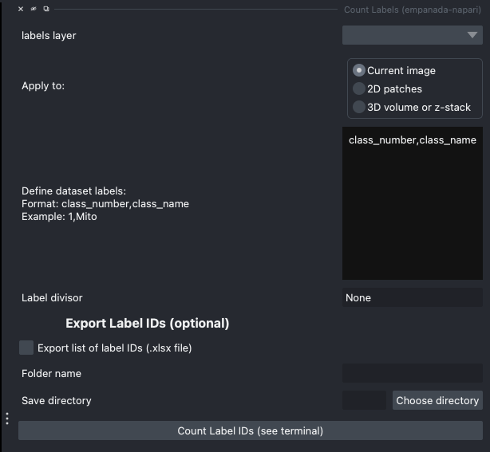

.. _count-labels:

Count Labels
---------------

Parameters
===============

**labels layer:** The napari labels layer on which to apply the label counts.

**Apply to:**

* **Current image:** Applies the label counter to the current image in the napari viewer.

* **2D patches:** Applies the label counter to the entire 2D stack of images and returns the total count for each class in the terminal per image in stack.

* **3D volume:** Applies the label counter to labels in the 3D volume image.

**Label divisor:** Label divisor that separates objects of different classes. Select `None` if only one class. For example for label divisor = 1000, class 1 instances = 1001, 1002 etc. Class 2 instances = 2001, 2002 etc.

**Export list of label IDs** `(.xlsx file)`: Check the box if you would like an excel file with the list of labels for
each class to be exported. The label IDs will be separated and saved in individual sheets per image in the stack or volume.

**Save directory:** Directory in which to save the label count excel file(s).

Output
==========

Counts the number of instances for each class on the selected label layer and prints the results on the terminal. When
**current image** is selected, the label IDs will also be listed in the terminal.

An Excel file will be created with the list of label IDs for each image, stack of images, or for the full volume if selected.

Demos
======

.. tab-set::

    .. tab-item:: Single Class

        .. image:: ../_static/count-label-demo.gif
            :width: 8000px
            :align: center
            :alt: Count Labels Module Demo

        .. tab-set::

            .. tab-item:: Current image

                .. image:: ../_static/single_count.png
                    :align: center
                    :width: 500px

            .. tab-item:: 2D patches

                .. image:: ../_static/batch_count.png
                    :align: center
                    :width: 500px

            .. tab-item:: 3D volume or z-stack

                .. image:: ../_static/volume_count.png
                    :align: center
                    :width: 500px

    .. tab-item:: Multiclass (panoptic)

        .. image:: ../_static/count-panoptic-demo.gif
            :width: 8000px
            :align: center
            :alt: Count Panoptic Labels Module Demo

        .. tab-set::

            .. tab-item:: Current image

                .. image:: ../_static/panop_current.png
                    :align: center
                    :width: 500px

            .. tab-item:: 2D patches

                .. image:: ../_static/panop_batch.png
                    :align: center
                    :width: 500px

            .. tab-item:: 3D volume or z-stack

                .. image:: ../_static/panop_volume.png
                    :align: center
                    :width: 500px
