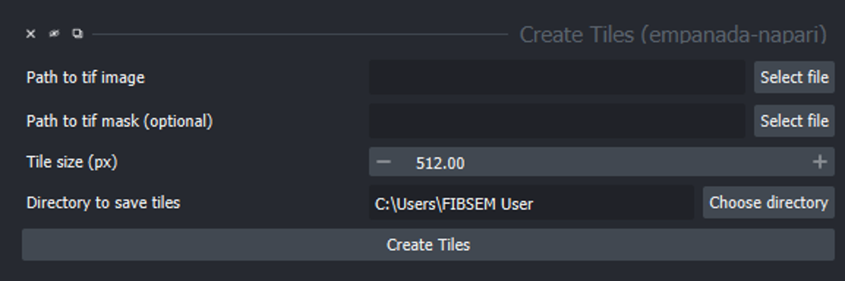

.. _create-tiles:

Create Tiles
------------------

Parameters
================

**Path to tif image:** Location of desired image.

**Path to tif mask (optional):** The location of the tif file that contains segmentations as a labels layer.

**Tile size (px):** Choose an appropriate pixel size to create tiles. Tiles will be squares. Smallest tile size 1280 px.

**Directory to save tiles:** File path of the directory to which resulting files will be saved.

Output
===========
Create Tiles will take the image given by the ‘path to tif image’ and will split that image into individual image tiles based on the tile size given. The image tiles will be saved in the indicated directory under a folder with im (image). If a ‘path to tif mask’ is also supplied, an additional folder msk (mask) will give mask tiles that match the image tiles. An additional metadata.tif file will be generated that must be retained for the image tiles to be merged back together again.

These mask tiles can be edited with the proofreading tools to fix the label segmentations that are present. It is advised not to rename these files or tile merging will not work, but to keep an original of each image tile and then overwrite another copy. Additionally, it is advised to run 2D inference only on the large image (the use Tile Size option in 2D inference can speed this up) and not on the individual tiles because this can lead to duplication of label numbers.

