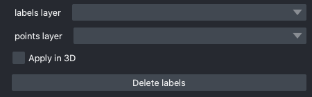

.. _delete-labels:

Delete labels
---------------

Parameters
=============

**labels layer:** The napari labels layer on which to apply operations.

**points layer:** A napari points layer used to select instances for deletion.

**Apply in 3D:** Whether to apply the delete operation within the an entire 3D labelmap. Generally should
be checked when proofreading 3D segmentations and unchecked when proofreading a stack of 2D segmentations
(for example, leave it unchecked when proofreading the output of 2D Batch Mode inference).

Results
=========

In-place deletes selected labels from a labels layer.

Demo
=======

.. image:: ../_static/delete-label-demo.gif
    :width: 8000px
    :align: center
    :alt: Delete Labels Module Demo

