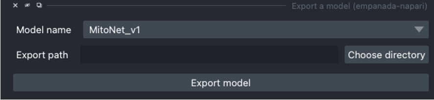

.. _export-model:

Export a model
------------------

Parameters
==================

**Model name:** Name of the model to export.

**Export path:** Location to export selected model.

Output
===========

Saves the selected model in a .empanada file.

