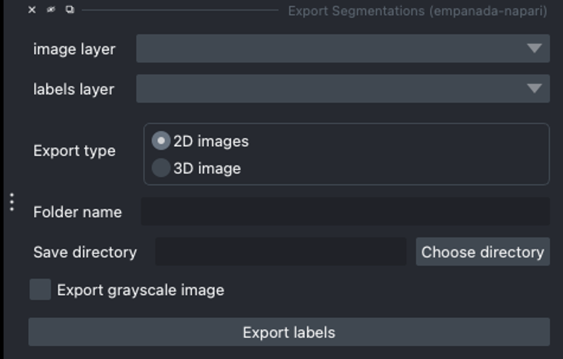
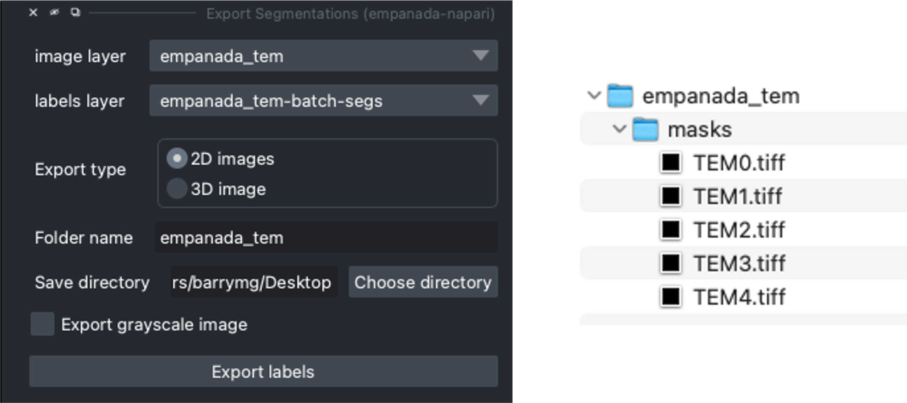

.. _export-seg:

Export Segmentations
----------------------

Parameters
===============

**Image layer:** The napari image layer.

**labels layer:** The napari labels layer on which to the segmentations are located.

**Export type:**

* **2D images:** Saves 2D segmentations (or label maps) in .tif files. (Use for single and batch mode segmentations)

* **3D image:** Saves 3D segmentations (or label map) in a single .tif file.

**Folder name:** Name of the dataset directory to create. If the dataset folder already exists, the new data will be appended.

**Save directory:** Directory in which to save the segmentations. A subdirectory labeled `masks` will be created.

**Export grayscale image:** If checked, the grayscale (image layer) will be exported in the same `export type` selected
and saved in a subdirectory labeled `images`.

Output
========

Creates or appends data to a directory with the folder name specified.
The segmentations will then be saved in a subdirectory folder labeled `masks`.

.. note::

    Selecting the export grayscale image option ensures the file structure is correct to use the dataset in
    the :ref:`Finetune a model <finetune-model>` and :ref:`Train a model <train-model>` modules. See a
    :ref:`file structure example <file-example>` in the :ref:`Training Best Practices <train-best-practice>` section.

.. image:: ../_static/export-grayscale.png
  :align: center
