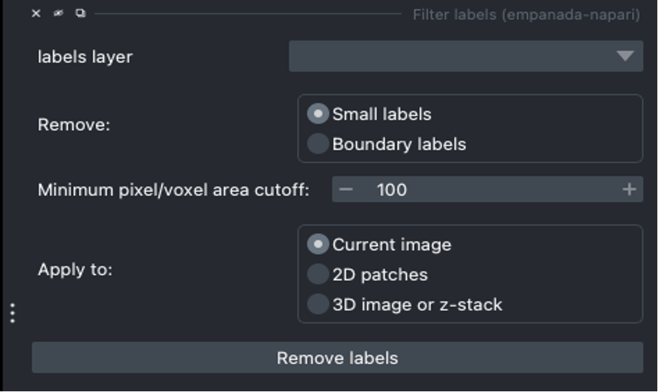

.. _filter-labels:

Filter Labels
-----------------

Parameters
=================

**labels layer:** The napari labels layer on which to apply filtering.

**Remove:**

* **Small labels:** Removes labels that are smaller than the minimum pixel/voxel area selected.

* **Boundary labels:** Removes labels on the boundary of the image.

**Minimum pixel/voxel area:** Minimum pixel/voxel area to keep. Labels smaller than this threshold will be removed.

**Apply to:**

* **Current image:** Applies the remove selection to the current image in the napari viewer.

* **2D patches:** Applies the remove selection to the entire 2D stack of images. Select this option if batch mode was used during inference.

* **3D volume:** Applies the remove selection to labels in the 3D volume image. Generally should be checked when proofreading 3D segmentations and unchecked when proofreading a stack of 2D segmentations (for example, leave it unchecked when proofreading the output of 2D Batch Mode inference).

.. note::

    If **2D patches** is selected, only images where a label mask actually touches the boundary is deleted. If **3D volume**
    is selected, the entire label mask is deleted if at any point the label touches the boundary.

Output
============

**Remove small labels:** Filters and removes labels smaller than a user selected threshold and saves as a new napari labels layer.

.. note::

    If the **Minimum pixel/voxel area** value is too small, there will be a printout in the terminal stating the smallest
    label ID and its corresponding area/volume. See example below.

    .. image:: ../_static/small_area_example.png
        :align: center

**Remove boundary labels:** Removes labels on the boundaries of an image and saves as a new napari labels layer.

.. note::

    Removing boundary labels with the 3D volume option selected can take time depending on the number of instances in the label map.
    For example, when applied to a label map that had ~250 labels, it took roughly ~3 minutes on a mac laptop but for a label map that had ~500
    instances it took ~10 minutes to complete on the same mac laptop.

Demos
=========

.. tab-set::

    .. tab-item:: Remove small labels

        .. image:: ../_static/filter-small-labels-new-demo.gif
            :width: 800px
            :align: center
            :alt: Filter small labels module demo video

    .. tab-item:: Remove boundary labels

        .. image:: ../_static/remove-boundary-labels-new-demo.gif
            :width: 800px
            :align: center
            :alt: Filter boundary labels module demo video