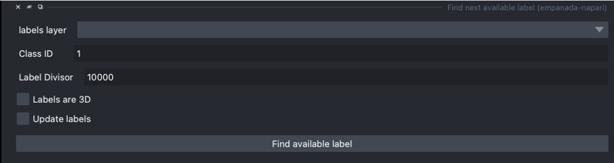
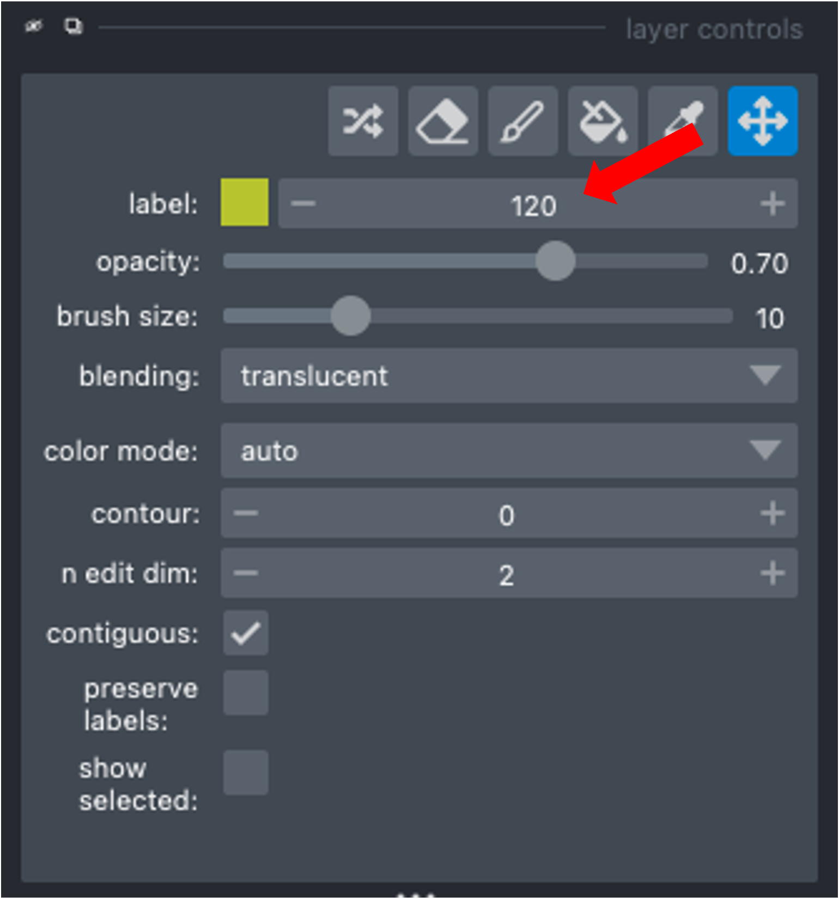

.. _find-next:

Find next available label
-----------------------------

Parameters
===============

**labels layer:** The napari labels layer on which to apply operations.

**Class ID:** Class ID for which to find next label.

**Label Divisor:** Label divisor that separates objects of different classes.

**Labels are in 3D:** Check the box if you are working with 3D labels.

**Update labels:** Check the box if you would like to update the list of working labels.
Will find available labels within the current working label ID list. If unchecked, will return the max
label ID + 1 for the class selected.

Results
============

Shows a label ID unused in the list of label IDs in the napari layer control panel (where the paint brush and
eraser are located).

