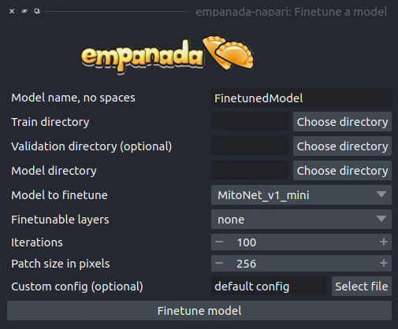

.. _finetune-model:

Finetune a model
--------------------

Parameters
============

**Model name, no spaces:** Name of the finetuned model as it will appear in the
other empanada modules after finetuning.

**Train directory:** Training directory for finetuning. Must conform to the
standard directory structure specified for empanada (as for example is created
by the :ref:`Save finetune/training patches <save-patches>` module).

**Validation directory (optional):** Validation directory. Must conform to the
standard directory structure specified for empanada. Can be the same as **Train directory**.

**Model directory:** Directory in which to save the finetuned model definition
and config file. The directory will be created if it doesn't exist already.

**Model to finetune:** Empanada model to finetune.

**Finetunable layers:** Layers to unfreeze in the model encoder during
finetuning. See **insert either best practice or FAQ link with photo description**

**Iterations:** Number of iterations to finetune the model.

**Patch size in pixels:** Patch size in pixels to use for random cropping of the image during finetuning.
Should be divisible by 16 for PanopticDeepLab model or 128 for PanopticBiFPN models. Use :ref:`Get model info <get-model-info>` to
check.

**Custom config (optional):** Use a custom config file to set other training
hyperparameters. `See here for a finetuning template to modify <https://github.com/volume-em/empanada-napari/blob/main/custom_configs/custom_finetuning.yaml>`_.

Output
=========

Saves and registers a .pth torchscript model that has been finetuned on
the provided data. Also saves a .yaml config with parameters necessary for
additional finetuning.

Demo
==========

.. image:: ../_static/finetuning-demo.gif
    :width: 8000px
    :align: center
    :alt: Finetune a Model Module Demo

Check out the step-by-step tutorial :ref:`here <finetune-tutorial>`!

