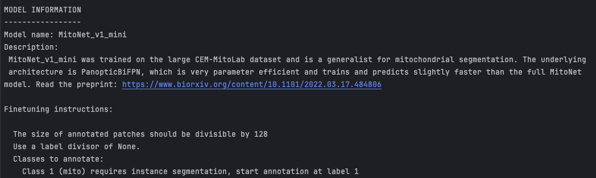
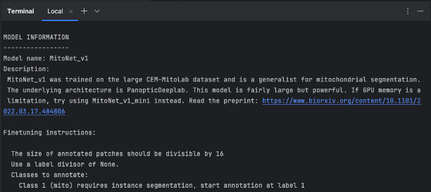

.. _get-model-info:

Get model info
------------------

Parameters
===============

**Model name:** Name of the model to get information about.

Output
========

Prints information about the model to the terminal.

