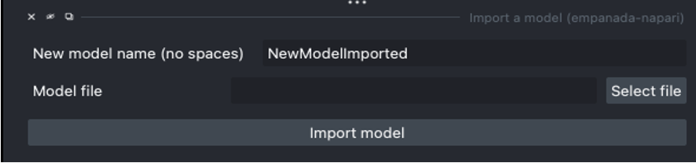

.. _import-model:

Import a model
------------------

Parameters
================

**New model name (no spaces):** Name to use for this model throughout the other plugin modules.

**Model file:** Path to the .empanada file defining the model.

Output
===========

Adds a new model to choose in the inference and training modules.

