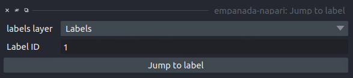
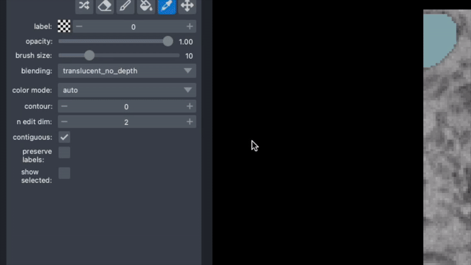

.. _jump:

Jump to label
------------------

Parameters
================

**labels layer:** The napari labels layer in which to find the label.

**Label ID:** Integer ID for the label to jump the viewer to.

Results
============

Moves the napari viewer to the first slice showing the given label ID, if found.

Demo
=====

