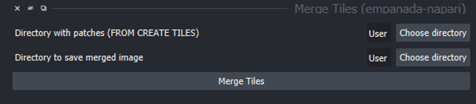

.. _merge-tiles:

Merge Tiles
------------------

Parameters
================

**Directory with patches:** Folder that contains image tiles (and mask files, if present) to be merged. Note: Must contain the original metadata.tif file that was output by Create tiles or Merge Tiles will fail.

**Directory to save merged image:** Folder where the final merged image (and merged mask file) will be saved.

Output
===========
Previously created tiles will be merged into a whole image. Output file will be titled im.tif and will need to be renamed to a more descriptive name. If there are associated segmentations files under msk file these will also be merged into a whole image with the same dimensions as the im.tif file. The output file will be titled msk.tif and will also need to be renamed.
