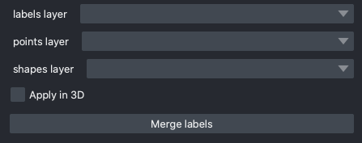

.. _merge-labels:

Merge labels
------------------

Parameters
===============

**labels layer:** The napari labels layer on which to apply operations.

**points layer:** A napari points layer used to select instances for merging.

**shapes layer:** An optional napari shapes layer used to select instances for merging/deletion. Currently,
support "line" and "path" shapes. Any instance ids intersected by the lines are merged. Arbitrary combinations
of shapes and points are allowed.

**Apply in 3D:** Whether to apply the merge operation within the an entire 3D labelmap. Generally should
be checked when proofreading 3D segmentations and unchecked when proofreading a stack of 2D segmentations
(for example, leave it unchecked when proofreading the output of 2D Batch Mode inference).

Output
===============

In-place merges selected labels from a labels layer.

Demo
======

.. image:: ../_static/merge-label-demo.gif
    :width: 800px
    :align: center
    :alt: Filter boundary labels module demo video
