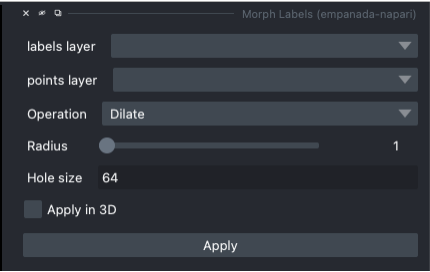
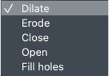

.. _morph-labels:

Morph Labels
------------------

Parameters
==============

**labels layer:** The napari labels layer on which to apply operations.

**points layer:** A napari points layer used to select instances for morphological operations.

.. note::

    If no points are placed, the selected morphological operation will be applied to all labels in the image (or stack if **Apply in 3D** is selected).

**Operation:** List of morphological operations to apply.

* **Dilate:** This operation expands or thickens the boundaries of objects in the label map. It can be used to join broken parts or increase the size of objects.

* **Erode:** This operation erodes away the boundaries of objects in the label map. It can be used to remove small noise or thin structures.

* **Close:** This operation combines dilation and erosion to close small gaps and holes in the label map.

* **Open:** This operation combines erosion and dilation to remove small objects and smooth the boundaries of larger objects.

* **Fill holes:** This operation fills small holes or gaps in the selected label.

**Radius:** The radius of the (disk (2D) or sphere (3D)) structuring element used for erosion, dilation, close, and open operations.

**Hole size:** The maximum size of holes to fill if the operation is set to "Fill holes".

**Apply in 3D:** Whether to apply the morphological operation within the entire 3D labelmap.
Generally should be checked when proofreading 3D segmentations and unchecked when proofreading a stack of 2D
segmentations (for example, leave it unchecked when proofreading the output of 2D Batch Mode inference).

Output
=============

Applies the selected morphological operation to the selected label or to the entire label layer.

Examples
=============

.. tab-set::

    .. tab-item:: Dilate

        Radius of 3 used

        .. grid:: 2
            :padding: 2 2 0 0

            .. grid-item::

                .. image:: ../_static/morph-dilate-before.png
                    :class: sd-m-auto

            .. grid-item::

                .. image:: ../_static/morph-dilate-after.png
                    :class: sd-m-auto

    .. tab-item:: Erode

        Radius of 3 used

        .. grid:: 2
            :padding: 2 2 0 0

            .. grid-item::

                .. image:: ../_static/morph-erode-before.png
                    :class: sd-m-auto

            .. grid-item::

                .. image:: ../_static/morph-erode-after.png
                   :class: sd-m-auto

    .. tab-item:: Close

        Radius of 5 used

        .. grid:: 2
            :padding: 2 2 0 0

            .. grid-item::

                .. image:: ../_static/morph-close-before.png
                    :class: sd-m-auto

            .. grid-item::

                .. image:: ../_static/morph-close-after.png
                   :class: sd-m-auto

    .. tab-item:: Open

        Radius of 5 used

        .. grid:: 2
            :padding: 2 2 0 0

            .. grid-item::

                .. image:: ../_static/morph-open-before.png
                    :class: sd-m-auto

            .. grid-item::

                .. image:: ../_static/morph-open-after.png
                   :class: sd-m-auto

    .. tab-item:: Fill Holes

        Hole size of 100 used

        .. grid:: 2
            :padding: 2 2 0 0

            .. grid-item::

                .. image:: ../_static/morph-fill-before.png
                    :class: sd-m-auto

            .. grid-item::

                .. image:: ../_static/morph-fill-after.png
                   :class: sd-m-auto

