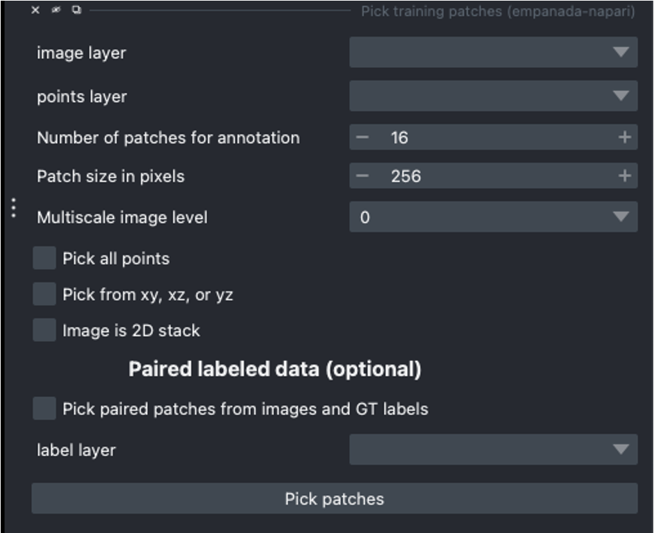
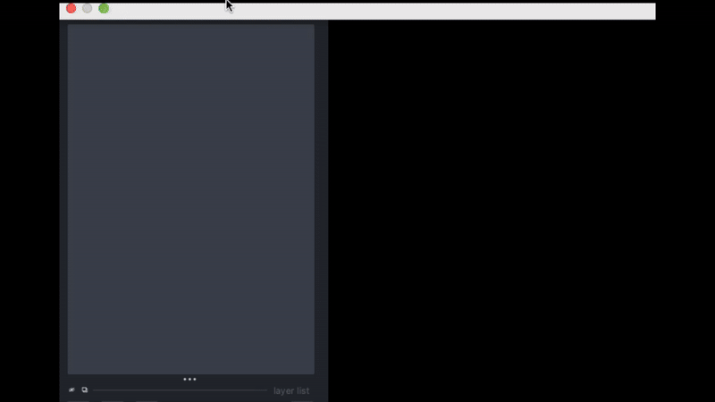

.. _pick-patches:

Pick finetune/training patches
----------------------------------

Parameters
============

**image layer:** The napari image layer from which to sample patches.

**points layer:** Optional. The napari points layer containing fiducial points
centered at ROIs to pick for annotation.

**Number of patches for annotation:** Number of patches to pick for annotation.
By default, patches are chosen randomly. If the points layer was given but has
fewer points than this number, the remainder will be made up with random patches.
Overwritten if **Pick all points** (below) is selected.

**Patch size in pixels:** The desired pixel size for chosen patches. All patches
are square.

**Multiscale image level:** If the image layer is a multiscale image, select the
resolution level from which to sample. It's assumed that images in each level
were downsampled by 2x.

**Pick all points:** If checked, patches will be created from all points in
the given points layer, regardless of the **Number of patches for annotation**
that was set.

**Pick from xy, xz, or yz:** If checked, patches will be arbitrarily selected from
any of the principle planes. Only select this option for nearly isotropic voxel
3D datasets.

**Image is 2D stack:** If checked, treats the image layer as a stack of unrelated
2D images. For example, check this box when picking patches from a directory
of 2D images that were loaded with the "Open Folder..." option.

Paired labeled data (Optional)
^^^^^^^^^^^^^^^^^^^^^^^^^^^^^^^^^^^^

**Pick paired patches (optional):** If checked, patches will be selected from the grayscale image and the corresponding
label layer.

**label layer:** The correspond napari labels layer from which to sample patches.

Results
===========

If the image to pick patches from is 3D, returns a set of flipbooks with five
images in each along with a corresponding labels layer of the same size. If the
image is instead 2D or a 2D stack, returns a set of patches and a labels layer
of matching size.

.. note::

  When flipbooks are returned, it's assumed that the middle image in each will
  be annotated. For example, in a flipbook with five images, only the third image
  should be segmented.

Demo
=========

