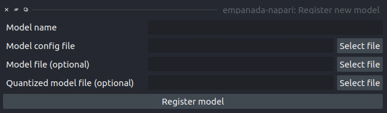

.. _register-model:

Register new model
----------------------

Parameters
=============

**Model name:** Name to use for this model throughout the other plugin modules.

**Model config file:** Config file for the model as created in the Finetuning and Training
modules or by exporting from the empanada library.

**Model file (optional):** Path or URL to the torchscript .pth file defining the model. If the path/url
given in the config file is correct this is unnecessary.

**Quantized model file (optional):** Path or URL to the quantized torchscript .pth file defining the model.
If the path/url given in the config file is correct this is unnecessary.

.. tip::

  If the 2D or 3D Inference module have already been opened, then registered models may not
  appear in the available models list. Open and close the relevant module or restart napari.

.. note::

  Removing models is manual. Simply delete or move the config file from `~/.empanada/configs`.

Results
========

Adds a new model to choose in inference and training modules.

