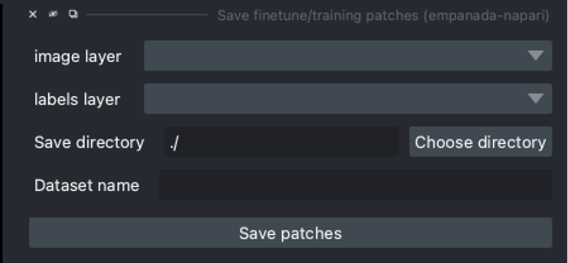
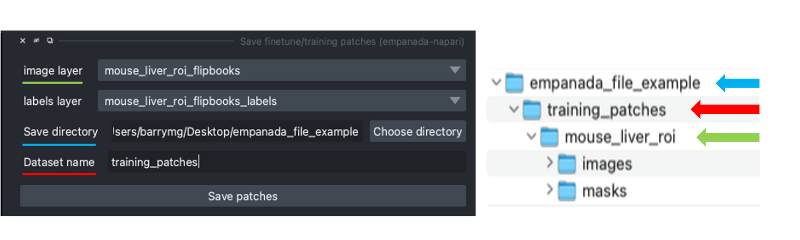

.. _save-patches:

Save finetune/training patches
==================================

Parameters
===============

**image layer:** The napari image layer for annotated patches or flipbooks.

**labels layer:** The napari labels layer for annotated patches or flipbooks.

**Save directory:** Directory in which to save the dataset. A subdirectory
with the given **Dataset name** (below) will be created.

**Dataset name:** Name of the dataset directory to create. If the dataset already
exists, the new data will be appended.

Output
===========

Creates or appends data to a directory with the structure expected for
model finetuning and training. If the image and labels layers are
flipbooks, only the middle image in each flipbook is saved.

.. note::

    When saving flipbooks, remember that only the middle image will be saved!