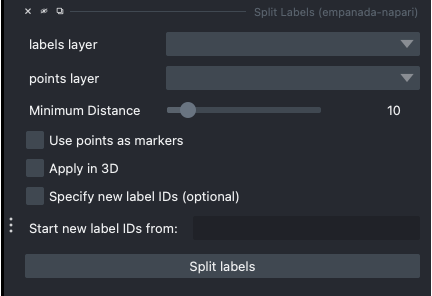

.. _split-labels:

Split labels
------------------

Parameters
===============
.. note::

  Only one instance can be split at a time. All points aside from the first one will
  be ignored and deleted unless **Use points as markers** (below) is checked.

**labels layer:** The napari labels layer for which to apply operations.

**points layers:** The napari points layer used to select instance for splitting.

**Minimum Distance:** Minimum distance from the boundary of the instance for
a pixel/voxel to be included in a watershed marker.

**Use points as markers:** If checked, minimum distance will be ignored and the
watershed transform will treat each point as a marker.

**Apply in 3D:** Whether to apply the split operation within the an entire 3D labelmap. Generally should
be checked when proofreading 3D segmentations and unchecked when proofreading a stack of 2D segmentations
(for example, leave it unchecked when proofreading the output of 2D Batch Mode inference).

.. admonition:: Tip
    :class: sidebar tip

    Specifying new label IDs can be useful when multiple people are correcting annotations on the same dataset.

Specify new label IDs (Optional)
^^^^^^^^^^^^^^^^^^^^^^^^^^^^^^^^^^

**Specify new label IDs:** Check if working with a small patch from a larger image.

**Start new label IDs from:** Specify where you would like the new label IDs to start from.

Results
=============

In-place splits the selected label in the labels layer.

Demo
=========

.. image:: ../_static/split-labels-new-demo.gif
    :width: 8000px
    :align: center
    :alt: Split Labels Module Demo

