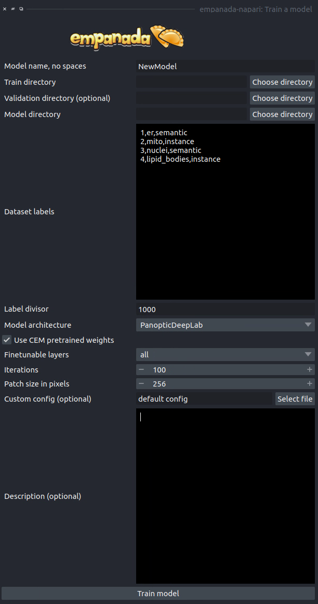

.. _train-model:

Train a model
-----------------

Parameters
==============

**Model name, no spaces:** Name of the model as it will appear in the
other empanada modules after training.

**Train directory:** Training directory for finetuning. Must conform to the
standard directory structure specified for empanada (as for example is created
by the :ref:`Save finetune/training patches <save-patches>` module).

**Validation directory (optional):** Validation directory. Must conform to the
standard directory structure specified for empanada. Can be the same as **Train directory**.

**Model directory:** Directory in which to save the trained model definition,
weights, and config file. The directory will be created if it doesn't exist already.

**Dataset labels:** List of labels in the training dataset. Each line is a comma separated list of three
items without spaces: <class_id>,<class_name>,<class_type>. Class IDs must be integers, class names
can be anything, class types must be either 'semantic' or 'instance'.

**Label divisor:** For mutliclass segmentation, the label divisor that was used
to offset the labels for each class.

**Model architecture:** The model architecture to use for training.

**Use CEM pretrained weights:** If checked the model encoder will be initialized
with the latest CEM weights. (CEM weights are created by self-supervised training
on the very large and heterogeneous CEM dataset).

**Finetunable layers:** Layers to unfreeze in the model encoder during
training. See **insert either best practice or FAQ link with photo description**. Ignored if **Use CEM pretrained weights** isn't checked.

**Iterations:** Number of iterations to train the model.

**Patch size in pixels:** Patch size in pixels to use for random cropping of the image during finetuning.
Should be divisible by 16 for PanopticDeepLab model or 128 for PanopticBiFPN models.

**Custom config (optional):** Use a custom config file to set other model and training
hyperparameters. `See here for a training template to modify <https://github.com/volume-em/empanada-napari/blob/main/custom_configs/custom_training_pdl.yaml>`_.

**Description:** Free form text description of the model including details about the training data, model purpose,
and other relevant information.

Results
============

Saves and registers a .pth torchscript model that has been trained on
the provided data. Also saves a .yaml config with parameters necessary for
additional finetuning.

Tutorial
=========

.. card::
    :img-top: ../_static/panoptic_result.png
    :shadow: md

    .. button-ref:: train-panoptic-model
        :ref-type: ref
        :click-parent:
        :color: primary
        :expand:

        Step-by-step guide for training a model
