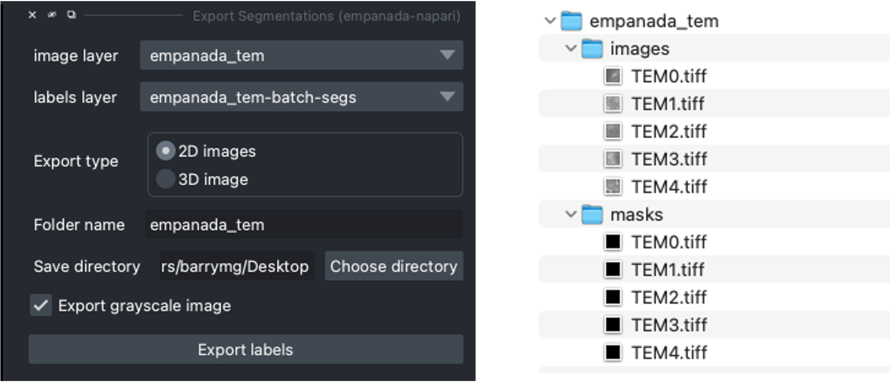

.. _2d-inference-tutorial:

Inference on 2D images
-----------------------

To get started, `download an example TEM image <https://zenodo.org/records/15319873/files/nanotomy_islet_rat375_crop1.tif?download=1>`_. (from nanotomy.org)

If you installed napari into a virtual environment as suggested in :ref:`Installation <installation>`, be sure to activate it::

    conda activate empanada

Launch napari::

    napari

Loading Directory of Images
""""""""""""""""""""""""""""""

After unzipping the downloaded data, choose "File > Open Folder", navigate to the empanada_tem directory,
and click "Open":

|pic1| |pic2|

.. note::

    You can also drag and drop the folder into the napari viewer. This will achieve the same result as above (i.e., all
    the images in the selected folder will be combined in one image layer in napari).

.. _downsample:

Tuning downsampling
""""""""""""""""""""""

Navigate to the plugin menu and select "2D Inference (Parameter Testing)":

Descriptions of all parameters are explained in :ref:`2D Inference (Parameter Testing) <2d-inference>`. The most
important parameter to tune is the **Image downsampling**. To start with, try the
**MitoNet_v1** model without downsampling, with 2x downsampling, and with 4x downsampling. Results
should look something like this (click the image for high-res):

The results are best without any downsampling but are still quite good even with 4x downsampling. As a rule, too
much downsampling will result in more false positive detections and more false negatives
for small objects in particular. Boundaries between closely packed objects will also be less well-defined.

As a counterpoint look at the effect of downsampling on the second image in the stack:

Here downsampling by a factor of 2 significantly reduces oversplitting errors and results in a better
pixel-level segmentation. Plus, the smaller image size means that model inference will
be faster and use less memory! The takeaway is that it's important to test different downsampling
factors on new datasets to see which is best. Always opt to use the largest downsampling factor
that gives satisfactory results.

.. _pick-model:

Choosing the right model
"""""""""""""""""""""""""""

By default, empanada-napari ships with two versions of the MitoNet model: **MitoNet_v1** and
**MitoNet_v1_mini**. As the name implies, **MitoNet_v1_mini** is a more compact version of
the full model. With ~30 million fewer parameters it runs 50-70% faster on GPU. Semantic
segmentation quality is almost equally good (sometimes better) but it's ability to
resolve individual instances isn't quite as strong. Here are results on the first
image of the stack with 2x downsampling; arguably the mini model yields a slightly
better segmentation.

Using Batch Mode
"""""""""""""""""""""""""""

Batch mode lets you run inference with a given parameter configuration on all images in the
stack. Running with the options shown on left will create a single segmentation layer.

.. _proofreading-2d:

Proofreading in 2D
"""""""""""""""""""""

To correct mistakes, use the proofreading tools to paint, erase, merge, split, apply morphological operations, and
delete labels.

.. tip::

    When proofreading and applying edits, it is recommended to duplicate the labels layer. At this time, empanada-napari
    does not support an "undo" function. This is a pain point we mean to address in the future.

Let's look at the second image in the stack. First, duplicate the labels layer by rick clicking on the layer and selecting
duplicate layer (panel **b** orange arrow). Then, select the new labels layer in the lower left hand panel (**c**). Next,
select the dropper tool, denoted by the green arrow in panel **a**, and click on the label you'd like to edit. Paint and
erase tools are denoted by the blue and red arrows in **a**, respectively. Simply click and drag to make corrections.

.. image:: ../_static/paint-erase-example.png
  :align: center
  :width: 100%

To run merge, split, delete, and morph operations, create a new points layer (red arrow in panel **b** below).
Place points by clicking the circle with a plus sign (panel **a**) and clicking in the viewer window.
The model output is shown in the top left corner of the figure below. After placing points on the
yellow and purple labels, click the **Merge labels** button. Make sure that the labels layer matches
the layer you're working on (see panel **b** in the previous figure), if not you'll get an "out-of-bounds"
error. Also, always leave the Apply 3D button unchecked when proofreading in 2D.

This overmerges the two instances. To split them, place a single point anywhere on the green label and
click the **Split labels** button (again making sure the labels layer selected is correct). The **Minimum distance** parameter
applies watershed to determine new instances, and **Minimum distance** slider will control how many fragments the label gets split into.

Repeat the merge operation by placing the four points shown in the top right of the figure.

.. tip::

    If you are working with smaller patches that will later be stitched together, you may want to specify the new
    label IDs when using the :ref:`Split Labels <split-labels>` module. To do this, select the box labeled **Specify new label IDs**
    and type in the new label ID number.

    .. note::

        If you enter 2001 into the **Start new label ID** box, the new label IDs will begin from 2001, 2002, and so on.

Exporting 2D
""""""""""""""

To export the segmentations, open the **Export Segmentations** module and select the final version of the labels layer
(assuming duplicate layers were created). Next, select the export type. Since the images are not a z-stack, select the
**2D images** option. This will save each labels layer image as a separate .tiff file. Enter in the desired **folder name** and
**save directory** and export the segmentations.

.. image:: ../_static/export-example.png
  :align: center

.. note::

    Selecting the **export grayscale image** option will export the grayscale images in the same export type selected in
    a sub folder labeled images. This can help ensure that the images and masks are in the proper file structure needed
    for the :ref:`Finetune a model <finetune-model>` and :ref:`Train a model <train-model>` modules.

