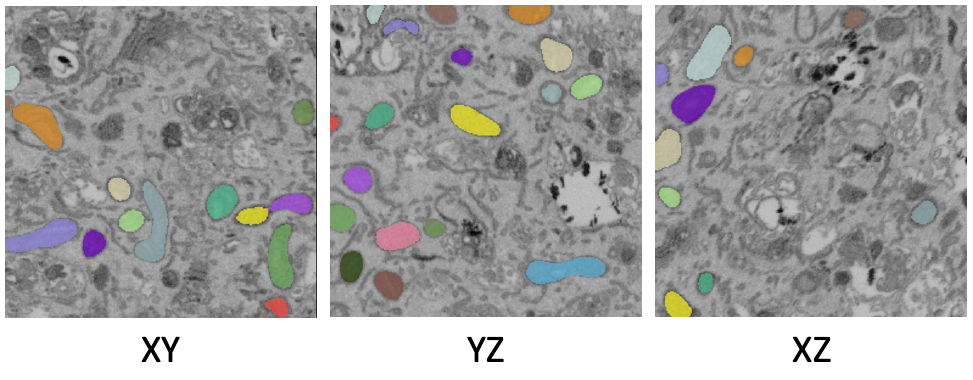
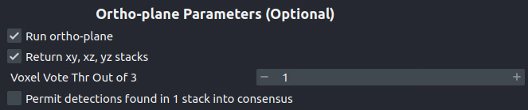
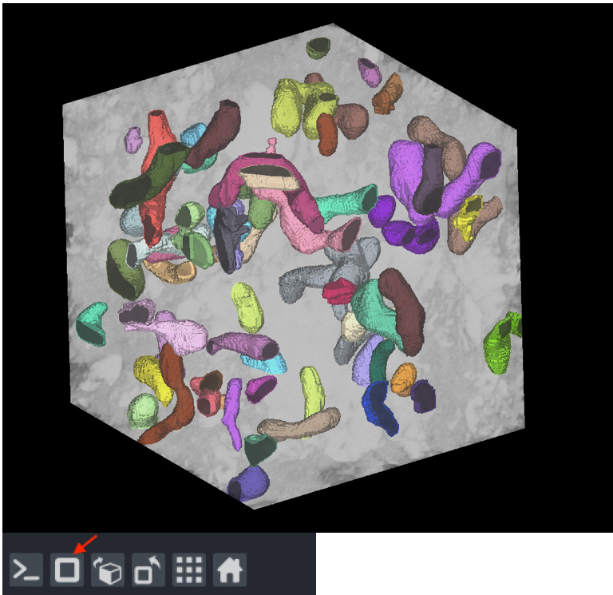
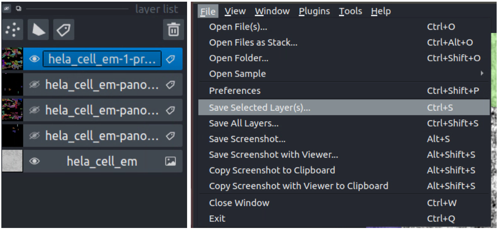

.. _3d-inference-tutorial:

Inference on volumetric data
------------------------------

To get started, `download an example HeLa cell FIBSEM dataset <https://www.dropbox.com/s/2gu3go2puzc47ip/hela_cell_em.tif?dl=0>`_.

If you installed napari into a virtual environment as suggested in :ref:`Installation <installation>`, be sure to activate it::

    conda activate empanada

Launch napari::

    napari

Loading HeLa Cell Data
""""""""""""""""""""""""""

Drag and drop the hela_cell_em.tif file into the napari window.

Parameter Testing
"""""""""""""""""""

Before running 3D inference, which may take a considerable amount of time for large volumes,
using the :ref:`2D Inference (Parameter Testing) <2d-inference>` for parameter testing. For more details see :ref:`Tuning downsampling <downsample>` and
:ref:`Choosing the right model <pick-model>`. In depth descriptions of how the other parameters affect model
output are provided in :ref:`Inference Best Practices <inference-best-practice>`.

It's important to test the model on all three principle planes: xy, xz, and yz in order to check
if ortho-plane inference or stack inference on a particular plane would be better. Click the
transpose button (red arrow below) to view and test models on different planes.

By default, xy planes are shown. One click of transpose will show yz planes, two clicks
will show xz planes and three clicks will bring it back to xy planes. After each transpose,
run the 2D Inference module and inspect results:

Here, the results are equally good on all three planes and the voxels are clearly
isotropic. That means this dataset is a good candidate for ortho-plane inference.

Running 3D Inference
""""""""""""""""""""""

All parameters and best practices for setting them are detailed in :ref:`3D Inference <3d-inference>`
and :ref:`Inference Best Practices <inference-best-practice>`, respectively. We'll run ortho-plane inference
with the parameters shown below.

.. note::

  For large datasets, it's recommended to start by running 3D inference on a small
  ROI of 256x256x256 or similar. Tweak parameters to get satisfactory results on
  this ROI before applying to the larger dataset.

  The consensus algorithm used to merge the xy, yz, and xz segmentation stacks
  can struggle when challenged with very closely packed together objects.
  If results look satisfactory with stack inference on the chosen ROI, then
  it's recommended to avoid ortho-plane inference. Checking the box to
  "Return xy, xz, and yz stacks" gives you the option to choose between any of
  the stacks or ortho-plane results without re-running inference. Note, however, that
  the stack inference results do NOT have small object filtering applied so may
  show more false positives than if they were generated outside of the ortho-plane
  inference workflow.

Visualizing the results
"""""""""""""""""""""""""

Results can be visualized in 3D by toggling the 3D viewer (red arrow).
Turn on and off the stack inference results and compare them to ortho-plane results.

Proofreading in 3D
"""""""""""""""""""""""""

The proofreading operations for 3D data work identically to those for :ref:`Proofreading in 2D <proofreading-2d>`.
Simply check the "Apply in 3D" option to merge, split, and delete labels throughout the entire volume.

.. note::

  If you chose to save the segmentations as zarr the split proofreading function
  will not work. We plan to address this gap in the future.

Exporting 3D
""""""""""""""

To save, simply select one or more layers and "Save selected layers":

or use the :ref:`Export Segmentations <export-seg>` module and select 3D image as the **Export type**.

.. note::

  If you chose to save the segmentations as zarr, there's no need to export
  them – they're already saved in the directory you picked.
