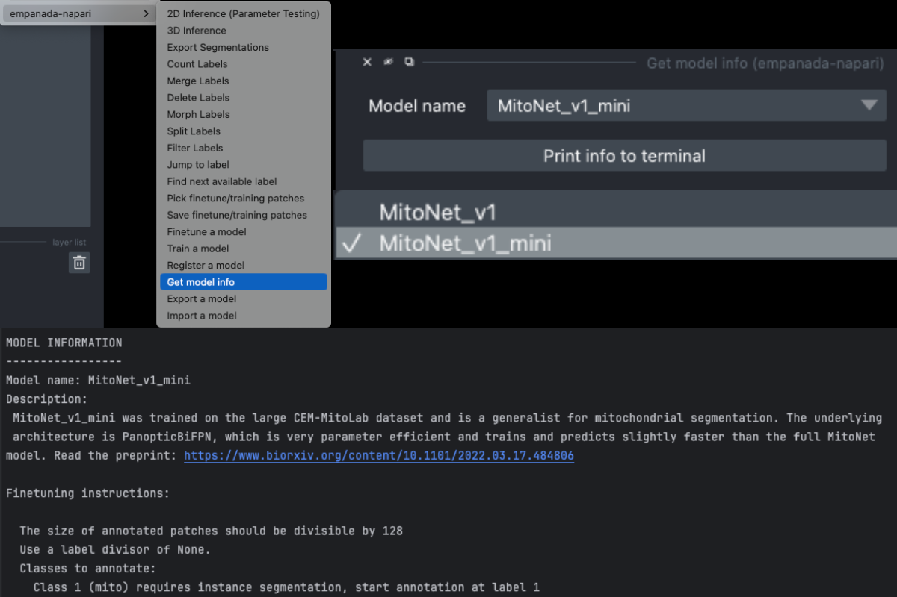

.. _finetune-tutorial:

Finetuning an existing model
-------------------------------

Finetuning a model involves modifying different parts of a pretrained model to better suit the characteristics of your data.

To get started, `download an example C. Elegans FIBSEM dataset <https://www.dropbox.com/s/hm8xg8n4raio99q/c_elegans_em.tif?dl=0>`_
and `some instance annotations <https://www.dropbox.com/s/qd8872r6cumbya2/c_elegans_mitos.zip?dl=0>`_. Unzip the annotations.

If you installed napari into a virtual environment as suggested in :ref:`Installation <installation>`, be sure to activate it::

    conda activate empanada

Launch napari::

    napari

Loading C. Elegans Data
=========================

Drag and drop the grayscale c_elegans_em.tif file into the napari window.

Choosing a model
===================

First, decide which model to finetune by using the :ref:`Get model info <get-model-info>` module, selecting a model from
the dropdown list, and clicking the "Print info to terminal" button. For this tutorial let's have
a look at the MitoNet_v1_mini model:

Looking at the finetuning instructions tells us that this model expects image patches
that are divisible by 128 and that it segments a single instance class: mitochondria.
It also tells us that we should start annotation with label 1 for the first mitochondrion
and increment by 1 for each subsequent mitochondrion.

.. _pick-training-data:

Picking training data
========================

.. note::

    With the newest updates to empanada-napari, picking finetuning/training data can be done in two ways. You can either select the finetune/training
    patches first and then create the annotations, **OR** you can create the patches after labels have been created. See the two
    sections below to see examples.

Creating patches first
------------------------

Open the :ref:`Pick finetune/training patches <pick-patches>` and :ref:`Save finetune/training patches <save-patches>` modules (green arrows). It's possible
to pick patches randomly from the entire volume or from a particular ROI by placing points. For example,
let's place 2 points on areas that we think may be difficult to segment. First, create a points layer
(red arrow bottom left), switch to point add mode (blue circle with + sign in middle left), and then
click to place points in the viewer. Now, we'll use the Pick finetune/training patches module to pick
16 patches of size 256x256, because this data has isotropic voxels we'll also check the "Pick from
xy, xz, or yz" box. The first 2 patches selected will be from the points that we placed, the other
14 patches will be randomly picked from the volume. To create patches from only the areas that you have placed points,
select the **Pick all points** option (see note).

.. note::

    This will overwrite the number of patches specified if the number of points does not match the number of points placed! Meaning, if
    you want to create 16 patches but only placed 2 points and have this option selected, only 2 patches will be created!

For 3D datasets, the patches are output as flipbooks (short stacks of 5 images). Only the middle (third image)
in each flipbook should be annotated, the other images are there to provide some 3D context. At the bottom of the
viewer you'll see that there are two sliders. The top one scrolls through the stack of images and the bottom one
scrolls through the flipbooks. Make sure all annotations are made on slice "2" of the top slider (bottom right panel).

See the next section for how to annotate flipbooks. Once all images have been annotated, select the appropriate flipbook
image and corresponding labels layer then click the "Save patches" button (top right panel).

.. note::

  Finetuning requires at least 16 training patches to be annotated. They can be completed in batches though,
  the :ref:`Save finetune/training patches <save-patches>` module will append them to an existing dataset if the directory and dataset name
  match.

.. _annotate-training-data:

Annotating training data
^^^^^^^^^^^^^^^^^^^^^^^^

To avoid confusion it's best to hide any layers other than the flipbook image and labels layer.

It's possible to use an existing model to get initial segmentation for cleanup. To do this,
open the :ref:`2D Inference (Parameter Testing) <2d-inference>` module, check the "Output to layer" box, and
select the flipbook labels layer "c_elegans_em_flipbooks_labels". Make sure you're on the third slice
of a flipbook and click "Run 2D Inference". This will insert the segmentation into the labels layer.
You can then paint and erase labels following :ref:`Proofreading in 2D <proofreading-2d>`.

.. note::

  If you use the settings shown in the figure above, you'll notice that the segmentation labels
  start at 1001. This is OK when the model only has one instance class, but if you have multiple classes
  then you'll have to make sure that the "Max objects per class" field is equal to the label divisor printed
  from :ref:`Get model info <get-model-info>`. The relevant line says, "Use a label divisor of {label_divisor}". The default label divisor
  for models trained in empanada is 1000. Anytime the label divisor is "None" you don't have to worry about which labels
  you use so long as they're unique for each instance.

Creating patches from paired data
----------------------------------

To create finetune/training patches from paired data, you can either use the initial results after running inference or you can use
Ground Truth labels. For this example, let's use the annotations we get after running 3D inference.

To get an idea of how well the base MitoNet_mini model performs on this dataset, let's run :ref:`3D Inference <3d-inference>` on the
c_elegans_em.tif image.

As you can see, the model does "okay" but it struggles in more complicated areas. To pick finetuning patches from these
particular ROIs , open the :ref:`Pick finetune/training patches <pick-patches>` module and create a new points layer (red arrow).
Next, switch to point add mode (blue circle with + sign in middle left), and then click to place points in the viewer. Scroll
through the stack and place a total of 16 points. Now, we'll use the Pick finetune/training patches module (green arrow) to pick
16 patches of size 256x256, we'll also select the **Pick paired patches** option (blue arrow) to pair the labels layer.

The patches are output as flipbooks (short stacks of 5 images). Only the middle (third image)
in each flipbook should be annotated (or in this case proofread), the other images are there to provide some 3D context. At the bottom of the
viewer you'll see that there are two sliders. The top one scrolls through the stack of images and the bottom one
scrolls through the flipbooks. Make sure all edits to annotations are made on slice "2" of the top slider (middle right panel).

Proofreading training data
^^^^^^^^^^^^^^^^^^^^^^^^^^^

To proofread (or clean up) the labels, follow the :ref:`Proofreading in 2D <proofreading-2d>` in the :ref:`2D Inference Tutorial <2d-inference-tutorial>`.
Remember that only the middle image will need to be edited!

Once you have finished making corrections, use the :ref:`Save finetune/training patches <save-patches>` module to save
the flipbook images and their corresponding labels layer (middle right panel).

Finetuning the model
=====================

Using the annotations that you created, finetuning a model is simple. We'll use the same annotations
for training and validation, though you could easily create a separate validation set if desired by following the steps
from the `Creating patches from paired data` section above (see note).

.. note::

    Instead of using the labels created by MitoNet_mini, drag and drop the annotations you downloaded earlier
    and select patches from there. See an example file structure with separate validation data below.

    .. image:: ../_static/finetune-val-example.png
        :align: center
        :width: 50%

Setting the "Finetubale layers" to "all" means that all encoder layers will be finetuned. This generally gives better
results, but training with fewer finetunable layers will require less memory and time. 100 training iterations
is a good starting point, but increasing the number of iterations may yield better results. For a fairly general
model like MitoNet, training for more than 500 iterations shouldn't be necessary unless you've annotated a lot
of images.

Once finetuning finishes, the model will appear in dropdowns across all other modules in the plugin. If it
doesn't, close the module and reopen it. Unsurprisingly, we see that a finetuned model works much better on
this data than vanilla MitoNet. See :ref:`Inference on 2D images <2d-inference-tutorial>` and :ref:`Inference on volumetric data <3d-inference-tutorial>`
for details on how to use the model for inference.