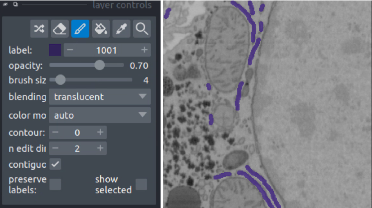
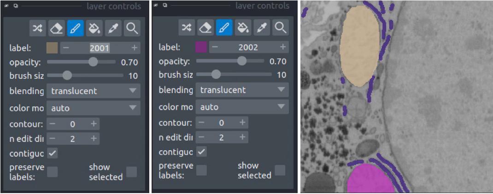
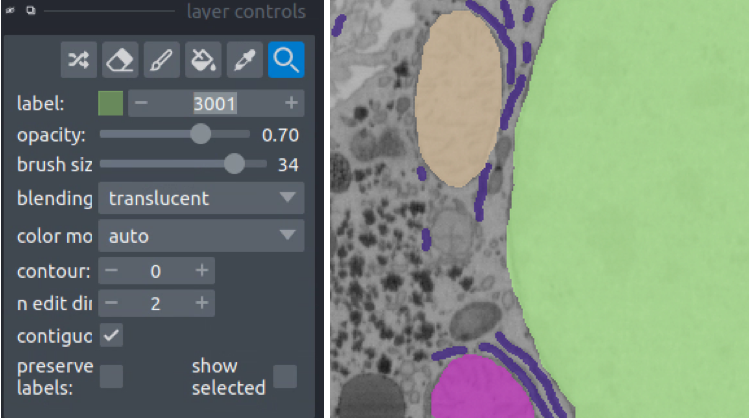
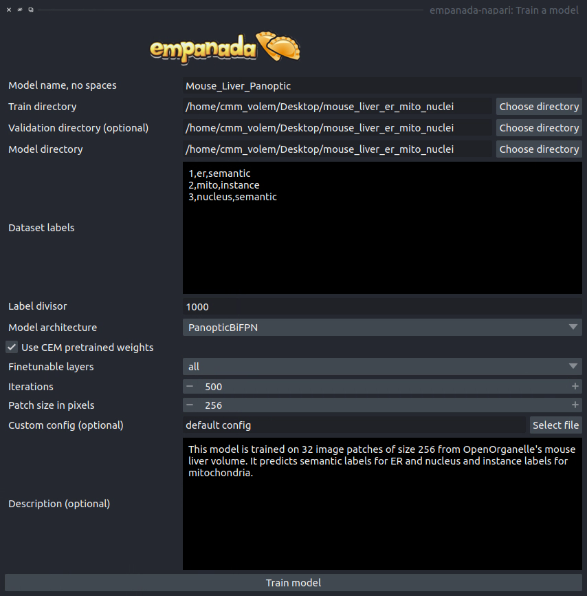
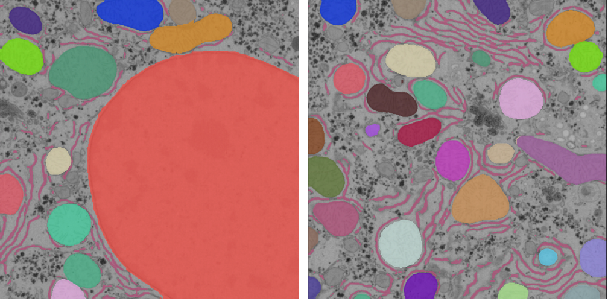

.. _train-panoptic-model:

Training a panoptic segmentation model
---------------------------------------

To get started, `download an example mouse liver FIBSEM dataset <https://www.dropbox.com/s/za9q1h2yancx1ow/openorganelle_mouse_liver_roi.tif?dl=0>`_
and `some panoptic annotations <https://www.dropbox.com/s/c4veu311mvk8ujx/mouse_liver_er_mito_nuclei.zip?dl=0>`_. Unzip the annotations.

If you installed napari into a virtual environment as suggested in :ref:`Installation <installation>`, be sure to activate it::

    conda activate empanada

Launch napari::

    napari

Loading Liver Data
""""""""""""""""""""

Drag and drop the openorganelle_mouse_liver_roi.tif file into the napari window.

Picking panoptic data
""""""""""""""""""""""""

See :ref:`Picking training data <pick-training-data>` in the :ref:`Finetuning an existing model tutorial <finetune-tutorial>`. The same instructions apply.

Annotating panoptic data
""""""""""""""""""""""""""

See :ref:`Annotating training data <annotate-training-data>` in the :ref:`Finetuning an existing model tutorial <finetune-tutorial>` to get started.
The key difference between annotation for instance and panoptic segmentation is the use of a label divisor.
The label divisor separates semantic and instance classes and allows for multiple objects to be segmented
for each instance class.

For this tutorial, we're interested in segmenting ER (semantic), mitochondria (instance), and nucleus (semantic).
The only requirement for the label divisor is that it is greater than the number of mitochondrial instances in any given patch.
To be very comfortable let's use a label divisor of 1,000, though 100 would be fine as well. Remember what you choose,
you'll need it later when training.

First, we'll label ER. Set the label to 1001 and paint all the ER:

Second, we'll paint each mitchondrial instance. Set the label to 2001 and paint the first mitochondrion, then
increase the label to 2002 and paint the second mitochondrion.

Finally, we'll paint the nucleus. Set the label to 3001 and paint all the nuclei.

Once all annotations are completed use the :ref:`Save finetune/training patches <save-patches>` module to save them to a directory.

Training the model
""""""""""""""""""""

Open the :ref:`Train a model <train-model>` module and fill in the train, validation, and model directory fields.
For the "Dataset labels" field, each line corresponds to a unique segmentation class. In this case,
the first segmentation class is ER, so the first line should be "1,er,semantic" (the order is class label,
class name, segmentation type). Class label should always be an integer, the class name can be any string,
and the segmentation type must be either "semantic" or "instance". The second and third lines are then
"2,mito,instance" and "3,nucleus,semantic", respectively. For the training data provided the label divisor is 1000.

While using CEM pretrained weights will significantly reduce the amount of time required to train a robust
and performant model, multiclass segmentation classes typically need to train for a longer time. For this
case 500 iterations may be enough, but 1,000 might be better. You should never need to train for more than
10,000 iterations.

Once training finishes, the model will appear in dropdowns across all other modules in the plugin. If it
doesn't, close the module and reopen it. Here's the result:

See the :ref:`Inference on 2D images <2d-inference-tutorial>` and :ref:`Inference on volumetric data <3d-inference-tutorial>`  for details on how to use the model for inference.